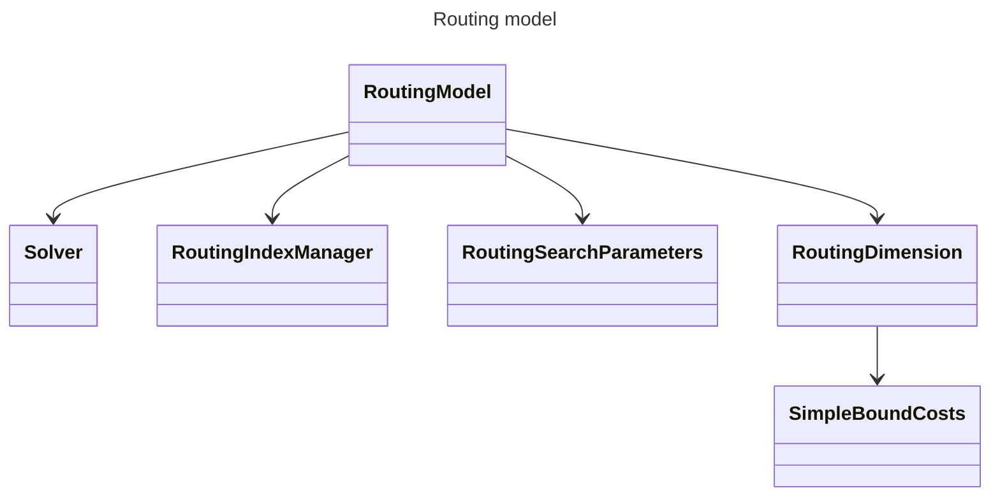

```mermaid
---
title: Routing model
---
classDiagram
    class RoutingModel {
    }
    RoutingModel --> Solver
    RoutingModel --> RoutingIndexManager
    RoutingModel --> RoutingSearchParameters
    RoutingModel --> RoutingDimension
    RoutingDimension --> SimpleBoundCosts
```
