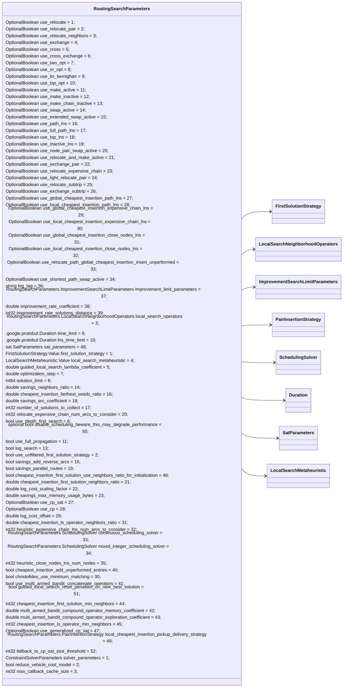

```mermaid
classDiagram
  direction LR
  RoutingSearchParameters --> FirstSolutionStrategy
  RoutingSearchParameters --> LocalSearchNeighborhoodOperators
  RoutingSearchParameters --> ImprovementSearchLimitParameters
  RoutingSearchParameters --> PairInsertionStrategy
  RoutingSearchParameters --> SchedulingSolver
  RoutingSearchParameters --> Duration
  RoutingSearchParameters --> SatParameters
  RoutingSearchParameters --> LocalSearchMetaheuristic
  %% smaller parameters
  class RoutingSearchParameters {
    OptionalBoolean use_relocate = 1;
    OptionalBoolean use_relocate_pair = 2;
    OptionalBoolean use_relocate_neighbors = 3;
    OptionalBoolean use_exchange = 4;
    OptionalBoolean use_cross = 5;
    OptionalBoolean use_cross_exchange = 6;
    OptionalBoolean use_two_opt = 7;
    OptionalBoolean use_or_opt = 8;
    OptionalBoolean use_lin_kernighan = 9;
    OptionalBoolean use_tsp_opt = 10;
    OptionalBoolean use_make_active = 11;
    OptionalBoolean use_make_inactive = 12;
    OptionalBoolean use_make_chain_inactive = 13;
    OptionalBoolean use_swap_active = 14;
    OptionalBoolean use_extended_swap_active = 15;
    OptionalBoolean use_path_lns = 16;
    OptionalBoolean use_full_path_lns = 17;
    OptionalBoolean use_tsp_lns = 18;
    OptionalBoolean use_inactive_lns = 19;
    OptionalBoolean use_node_pair_swap_active = 20;
    OptionalBoolean use_relocate_and_make_active = 21;
    OptionalBoolean use_exchange_pair = 22;
    OptionalBoolean use_relocate_expensive_chain = 23;
    OptionalBoolean use_light_relocate_pair = 24;
    OptionalBoolean use_relocate_subtrip = 25;
    OptionalBoolean use_exchange_subtrip = 26;
    OptionalBoolean use_global_cheapest_insertion_path_lns = 27;
    OptionalBoolean use_local_cheapest_insertion_path_lns = 28;
    OptionalBoolean use_global_cheapest_insertion_expensive_chain_lns = 29;
    OptionalBoolean use_local_cheapest_insertion_expensive_chain_lns = 30;
    OptionalBoolean use_global_cheapest_insertion_close_nodes_lns = 31;
    OptionalBoolean use_local_cheapest_insertion_close_nodes_lns = 32;
    OptionalBoolean use_relocate_path_global_cheapest_insertion_insert_unperformed = 33;
    OptionalBoolean use_shortest_path_swap_active = 34;
    string log_tag = 36;
    RoutingSearchParameters.ImprovementSearchLimitParameters improvement_limit_parameters = 37;
    double improvement_rate_coefficient = 38;
    int32 improvement_rate_solutions_distance = 39;
    RoutingSearchParameters.LocalSearchNeighborhoodOperators local_search_operators = 3;
    .google.protobuf.Duration time_limit = 9;
    .google.protobuf.Duration lns_time_limit = 10;
    sat.SatParameters sat_parameters = 48;
    FirstSolutionStrategy.Value first_solution_strategy = 1;
    LocalSearchMetaheuristic.Value local_search_metaheuristic = 4;
    double guided_local_search_lambda_coefficient = 5;
    double optimization_step = 7;
    int64 solution_limit = 8;
    double savings_neighbors_ratio = 14;
    double cheapest_insertion_farthest_seeds_ratio = 16;
    double savings_arc_coefficient = 18;
    int32 number_of_solutions_to_collect = 17;
    int32 relocate_expensive_chain_num_arcs_to_consider = 20;
    bool use_depth_first_search = 6;
    optional bool disable_scheduling_beware_this_may_degrade_performance = 50;
    bool use_full_propagation = 11;
    bool log_search = 13;
    bool use_unfiltered_first_solution_strategy = 2;
    bool savings_add_reverse_arcs = 15;
    bool savings_parallel_routes = 19;
    bool cheapest_insertion_first_solution_use_neighbors_ratio_for_initialization = 46;
    double cheapest_insertion_first_solution_neighbors_ratio = 21;
    double log_cost_scaling_factor = 22;
    double savings_max_memory_usage_bytes = 23;
    OptionalBoolean use_cp_sat = 27;
    OptionalBoolean use_cp = 28;
    double log_cost_offset = 29;
    double cheapest_insertion_ls_operator_neighbors_ratio = 31;
    int32 heuristic_expensive_chain_lns_num_arcs_to_consider = 32;
    RoutingSearchParameters.SchedulingSolver continuous_scheduling_solver = 33;
    RoutingSearchParameters.SchedulingSolver mixed_integer_scheduling_solver = 34;
    int32 heuristic_close_nodes_lns_num_nodes = 35;
    bool cheapest_insertion_add_unperformed_entries = 40;
    bool christofides_use_minimum_matching = 30;
    bool use_multi_armed_bandit_concatenate_operators = 41;
    bool guided_local_search_reset_penalties_on_new_best_solution = 51;
    int32 cheapest_insertion_first_solution_min_neighbors = 44;
    double multi_armed_bandit_compound_operator_memory_coefficient = 42;
    double multi_armed_bandit_compound_operator_exploration_coefficient = 43;
    int32 cheapest_insertion_ls_operator_min_neighbors = 45;
    OptionalBoolean use_generalized_cp_sat = 47;
    RoutingSearchParameters.PairInsertionStrategy local_cheapest_insertion_pickup_delivery_strategy = 49;
    int32 fallback_to_cp_sat_size_threshold = 52;
    ConstraintSolverParameters solver_parameters = 1;
    bool reduce_vehicle_cost_model = 2;
    int32 max_callback_cache_size = 3;
  }
```
