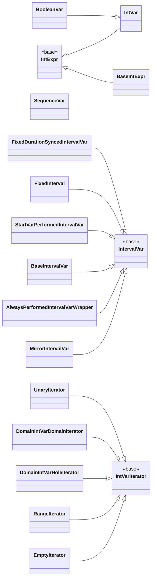

```mermaid
classDiagram
  direction LR
  class IntExpr{
    <<base>>
  }
  IntExpr <|-- IntVar
  IntExpr <|-- BaseIntExpr
  BooleanVar --|> IntVar
  class SequenceVar
  class IntervalVar{
    <<base>>
  }
  MirrorIntervalVar --|> IntervalVar
  AlwaysPerformedIntervalVarWrapper --|> IntervalVar
  BaseIntervalVar --|> IntervalVar
  StartVarPerformedIntervalVar --|> IntervalVar
  FixedInterval --|> IntervalVar
  FixedDurationSyncedIntervalVar --|> IntervalVar
  %% Iterators
  class IntVarIterator{
    <<base>>
  }
  EmptyIterator --|> IntVarIterator
  RangeIterator --|> IntVarIterator
  DomainIntVarHoleIterator --|> IntVarIterator
  DomainIntVarDomainIterator --|> IntVarIterator
  UnaryIterator --|> IntVarIterator
```
