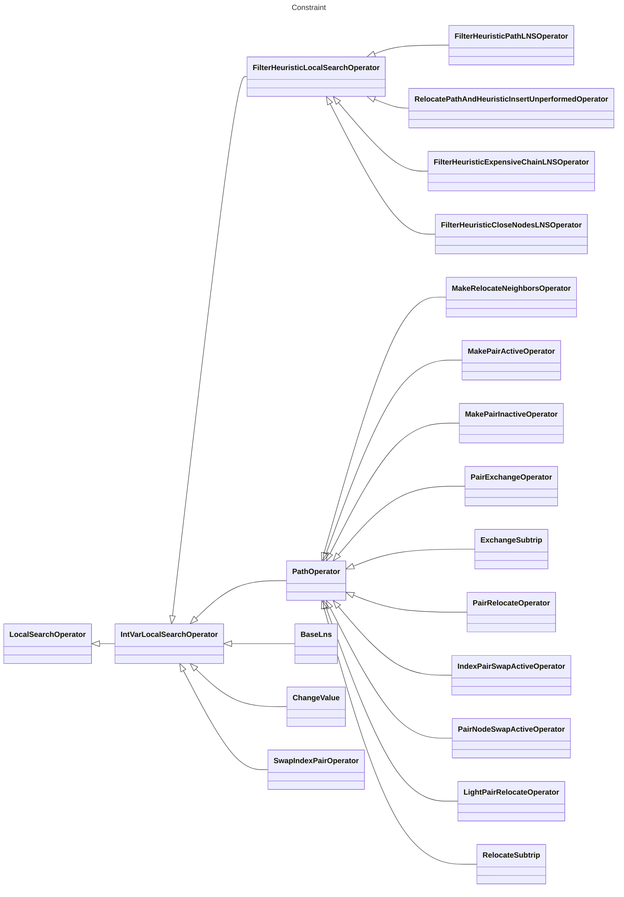

```mermaid
---
title: Constraint
---
classDiagram
  direction LR
  class IVLCO["IntVarLocalSearchOperator"]
  class FHLSO["FilterHeuristicLocalSearchOperator"]
  class PO["PathOperator"]
  LocalSearchOperator <|-- IVLCO
  IVLCO <|-- BaseLns
  IVLCO <|-- ChangeValue
  IVLCO <|-- FHLSO
  IVLCO <|-- SwapIndexPairOperator
  IVLCO <|-- PO
  PO <|-- MakeRelocateNeighborsOperator
  PO <|-- MakePairActiveOperator
  PO <|-- MakePairInactiveOperator
  PO <|-- PairExchangeOperator
  PO <|-- ExchangeSubtrip
  PO <|-- PairRelocateOperator
  PO <|-- IndexPairSwapActiveOperator
  PO <|-- PairNodeSwapActiveOperator
  PO <|-- LightPairRelocateOperator
  PO <|-- RelocateSubtrip
  FHLSO <|-- FilterHeuristicPathLNSOperator
  FHLSO <|-- RelocatePathAndHeuristicInsertUnperformedOperator
  FHLSO <|-- FilterHeuristicExpensiveChainLNSOperator
  FHLSO <|-- FilterHeuristicCloseNodesLNSOperator
```
